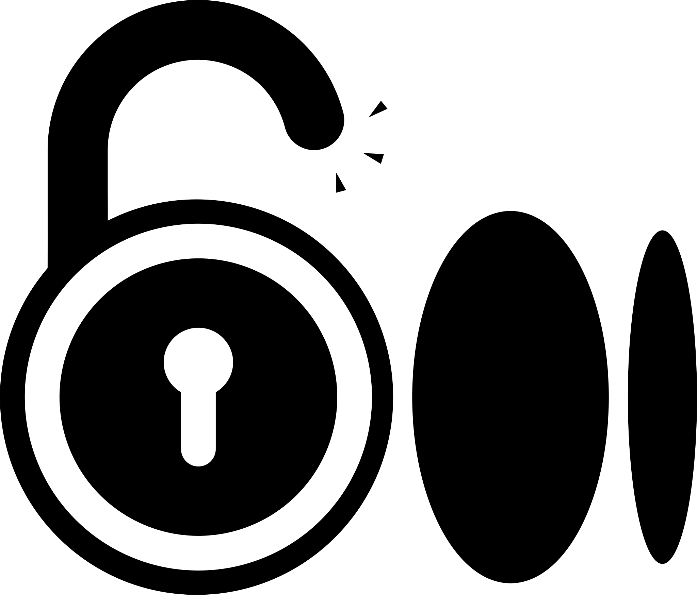

<div align='center'>
  

# Freedium

**Read articles from seven leading publishers without a subscription.**

**Medium** &nbsp;·&nbsp; **The New York Times** &nbsp;·&nbsp; **The Washington Post** &nbsp;·&nbsp; **Bloomberg** &nbsp;·&nbsp; **Reuters** &nbsp;·&nbsp; **The Economist** &nbsp;·&nbsp; **Financial Times**

*The Android app was renamed from Medium Unlocker to Freedium. The web version stays at
[medium-unlocker.inulute.com](https://medium-unlocker.inulute.com) under its original name.*

<a href="https://medium-unlocker.inulute.com/">
  
</a>
<a href="https://github.com/inulute/freedium-app/releases/latest">
  
</a>

<br><br>

<a href="https://github.com/inulute/freedium-app/stargazers">
  
</a>
<a href="https://github.com/inulute">
  
</a>
</div>

---

## Supported Publishers

Those seven are the sites [freedium.cfd](https://freedium.cfd) indexes directly. Links from them can be opened straight from the Android share sheet, or set to open in the app automatically. The Archive.is mirrors work on a wider range of sites, though with less reliable results.

---

## Project Background

- Paywalls make casual reading frustrating, and a subscription per publisher is not realistic for occasional articles.
- freedium.cfd hosts publicly readable versions of articles from the publishers above, but there was no polished way to reach them from a phone.
- Freedium bridges that gap: paste or share a link and it opens through your chosen mirror, with reading history, bookmarks and offline-friendly conveniences layered on top.

---

## Feature Highlights

### Android — Freedium
- **Native shell** – Java + WebView with Material Design styling.
- **Share sheet target** – Share a link from any app and it opens here.
- **Deep links** – Article links from all seven publishers can open directly in the app instead of the browser.
- **Mirror selector** – Choose between Freedium Mirror, Freedium, Archive.is and Archive.is (Alt).
- **Auto-fallback** – If the selected mirror fails, the next one is tried automatically.
- **History and bookmarks** – Every article you open is saved, with search across both.
- **Bookmark categories** – File bookmarks into categories and filter by them.
- **Reading positions** – Scroll position is remembered per article.
- **Copy as Markdown** – Copies the whole article to your clipboard as markdown, with headings, code blocks and images intact.
- **Hide Site Popups** – Optional setting that suppresses the mirror site's announcement toasts while you read.
- **Auto-paste** – Optionally fills the URL box from your clipboard on open.
- **Export / Import** – Back up history, bookmarks, categories, reading positions and settings as a JSON file.
- **Text zoom** – Adjust article font size from 50% to 200%.

### Web — [Medium Unlocker](https://medium-unlocker.inulute.com)
- **Purpose-built frontend** – React SPA with a bespoke dark interface.
- **Mirror selector** – The same four mirrors as the app, remembered between visits.
- **Recent and Saved** – Lightweight history and bookmarks, stored in your browser.
- **Paste button** – Fills the box from your clipboard in one click.

> [!NOTE]
> The web version keeps the Medium Unlocker name so it stays distinct from the
> freedium.cfd service it calls; only the Android app was renamed. The two also
> keep separate data — the website stores its list in your browser's local
> storage, and nothing syncs between them.

---

## Quick Start

### Web
1. Go to [medium-unlocker.inulute.com](https://medium-unlocker.inulute.com).
2. Paste an article URL from any supported publisher.
3. Hit **Unlock Article** and read it through the mirror.

### Android
1. [Grab the latest APK](https://github.com/inulute/freedium-app/releases/latest).
2. Install (you may need to allow side-loading).
3. Either:
   - Share an article link and pick **Freedium**, or
   - Open the app, paste a URL, tap **Unlock**.

To have links open in the app automatically on Android 12 and above, use the in-app prompt to open **Open by default** in system settings and add the publisher domains.

---

## Tech Stack

| Layer   | Stack                                                        |
|---------|--------------------------------------------------------------|
| Web     | React 18, Create React App, plain CSS, Inter font, Netlify   |
| Android | Java, Material Components, WebView, SharedPreferences        |

---

## Building

### Android
```bash
cd android
./gradlew assembleRelease
```
Release signing is optional: drop a `keystore.properties` in `android/` with `storeFile`, `storePassword`, `keyAlias` and `keyPassword` to sign, or omit it to build unsigned.

### Web
```bash
cd website
npm install
npm run build
```

---

## Disclaimer

> [!WARNING]
> **For educational purposes only.** You are responsible for respecting each publisher's Terms of Service and your local laws. This project does not host or redistribute any article content; it opens links through third-party mirrors.

> [!NOTE]
> **Service availability.** Freedium depends on freedium.cfd and Archive.is, which are third-party services. Their uptime, indexing speed and article coverage are outside my control, and some articles may simply not be available.

> [!NOTE]
> **Unofficial.** This project is not affiliated with, endorsed by, or operated by freedium.cfd, Medium, or any publisher listed above.

---

## Contributing

Issues and pull requests are welcome.

1. Fork the repo and create a branch.
2. Make your change — see **Building** above for the toolchains.
3. Open a pull request describing what changed and why.

Bug reports are most useful with your Android version, the app version, the mirror you had selected, and the article URL if you can share it.

---

## Feedback & Support

- Issues: [GitHub Issues](https://github.com/inulute/freedium-app/issues)
- Ideas: [Discussions](https://github.com/inulute/freedium-app/discussions)
- Contact: [socials.inulute.com](https://socials.inulute.com)
- Helpdesk: [support.inulute.com](https://support.inulute.com)

---

## Donate

<div align="center">
  <a href="https://support.inulute.com/donate">
    
  </a>
</div>

---

## License

MIT License – see [`LICENSE`](https://github.com/inulute/freedium-app/blob/main/LICENSE) for details.

<div align="center">
  
</div>

---

## Credits

- **freedium.cfd** – the public mirror this project is built around.
- **Material Components and React teams** – foundational tooling.

---

<a href="https://github.com/inulute/freedium-app">
    
  </a>

<div align="center">

**Created by [inulute](https://github.com/inulute)**  
[Website](https://medium-unlocker.inulute.com) • [Download](https://github.com/inulute/freedium-app/releases/latest) • [Support](https://support.inulute.com) • [GitHub](https://github.com/inulute)

</div>
